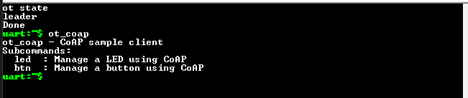
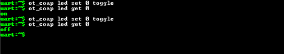
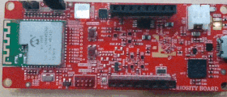

# Openthread Coap Application

Procedure to build and run the openthread coap application can also be found at [OpenThread CoAP client and server application — Zephyr Project Documentation](https://docs.zephyrproject.org/latest/samples/net/openthread/coap/README.html#ot-coap).

## Building Openthread Coap FTD Server application

1. To build openthread coap server application, which is part of zephyr repo, use the below command,
```bash
west build -p always -b wbz451_curiosity -T sample.net.openthread.ftd.coap.server ./zephyr/samples/net/openthread/coap/  "-DEXTRA_CONF_FILE=boards/wbz45x_curiosity.conf"
```
**Note:** Modify the board name as per the requirements
2. The openthread coap application is built with default configuration as in [prj.cnf](https://github.com/zephyrproject-rtos/zephyr/blob/main/samples/net/openthread/coap/prj.conf) file.
3. The output of the build will be available at location $zephyrproject$/zephyr/build/zephyr/ folder.
4. To flash the executable, use the following command.
```bash
west flash
```

## Building Openthread Coap FTD Client application

1. To build openthread coap Client application, which is part of zephyr repo, use the below command,
```bash
west build -p always -b wbz451_curiosity -T sample.net.openthread.ftd.coap.client ./zephyr/samples/net/openthread/coap/ "-DEXTRA_CONF_FILE=boards/wbz45x_curiosity.conf"
```
**Note:** Modify the board name as per the requirements
2. The openthread coap application is built with default configuration as in [prj.cnf](https://github.com/zephyrproject-rtos/zephyr/blob/main/samples/net/openthread/coap/prj.conf) file.
3. The output of the build will be available at location $zephyrproject$/zephyr/build/zephyr/ folder.
4. To flash the executable, use the following command.
```bash
west flash
```

## Running Openthread Coap FTD Server and Client application

1. Flash the two nodes with Coap server and Client image.
2. Open the tera terminal for both the nodes and verify the state. A valid state could be child, router or leader.
3. Once Thread network is operational, you could start using client.

  

### Controlling server board’s LED using a button on client board

- Press the button sw0 on the client and you should see led0 toggling on the client board.
- The client uses a broadcast address to request CoAP server to toggle the LED. It does not know the address of the server so if there is a second server on the network, then the LED of the second board will toggle too.

### Controlling server board’s LED using shell command

- The example also provides a shell command to control the LED on the server from the client.
- To toggle the LED:

  
  

## Configuring Openthread Coap Application

Following are the list of KCONFIG macros that can be modified as per user requirements in [prj.cnf](https://github.com/zephyrproject-rtos/zephyr/blob/main/samples/net/openthread/coap/prj.conf) file.
- To update the latest thread version, add the following macro to prj.cnf file

##### Openthread Thread Version
```bash
CONFIG_OPENTHREAD_THREAD_VERSION_1_4=y
```
