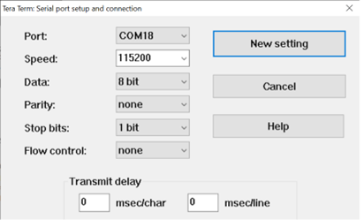
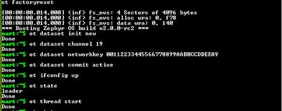
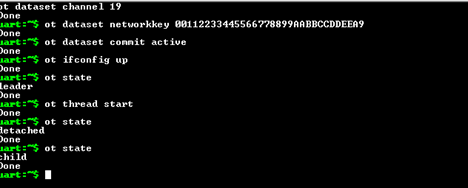
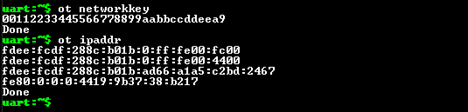
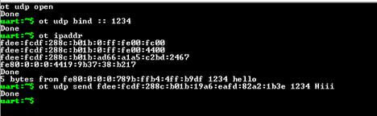
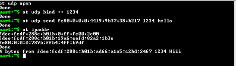

# Openthread Shell Application
Procedure to build and run the Openthread shell application can also be found at [OpenThread shell — Zephyr Project Documentation](https://docs.zephyrproject.org/latest/samples/net/openthread/shell/README.html#openthread-shell)

## Building

1. To build Openthread shell application, which is part of zephyr repo, use the below command,
```bash
west build -p always -b wbz451_curiosity ./zephyr/samples/net/openthread/shell/
```
**Note:** Modify the board name as per the requirements
2. The Openthread shell application is built with default configuration as in prj.cnf file.
3. The output of the build will be available at location $zephyrproject$/zephyr/build/zephyr/ folder.
4. To flash the executable, use the following command.
```bash
west flash
```

## Running

1. Open the tera terminal of the device under test. Configure the UART parameters as shown in below picture.

  

2. The below commands are to be inputted in node1 to form the thread network with Leader role. After successful inputting of each command thread stack responds as "Done".
**Node 1:**
```bash
> ot dataset init new
> ot dataset channel 19
> ot dataset networkkey 00112233445566778899AABBCCDDEEA9
> ot dataset commit active
> ot ifconfig up
> ot state
> ot thread start
> ot state
```
3. Once the above commands are executed the node1 forms the thread network and assigns itself with leader role as shown in the below image.

  

4. The below commands are to be inputted in node2 to join the thread network formed by node1. After successful inputting of each command thread stack responds as "Done".
**Node 2:**
```bash
> ot dataset channel 19
> ot dataset networkkey 00112233445566778899AABBCCDDEEA9
> ot dataset commit active
> ot ifconfig up
> ot state
> ot thread start
> ot state
```
5. Once the above commands are executed the node2 joins the thread network formed by node1 with child role as shown in the image below.

  

6. Get the IP Address of each node for further communication by using following command and IP addresses of node1 and node 2 are shown below.
**Node 1:**

  

**Node 2:**

  

7. Verify the communication between the nodes using udp command.
**From Node 1:**

  

**From Node 2:**

  

## Configuring Openthread Shell Application
Following are the list of KCONFIG macros that can be modified as per user requirements in prj.cnf file.

- To update the latest thread version, add the following macro to [prj.cnf](https://github.com/zephyrproject-rtos/zephyr/blob/main/samples/net/openthread/shell/prj.conf) file.
##### Openthread Thread Version
```bash
CONFIG_OPENTHREAD_THREAD_VERSION_1_4=y
```
##### Network Parameters
- To start Thread network manually, add the following Kconfig option so that OpenThread will NOT automatically start at boot and Network parameters can be modified in compile time.
```bash
CONFIG_OPENTHREAD_MANUAL_START=y
CONFIG_OPENTHREAD_OPERATIONAL_DATASET_AUTO_INIT=y
CONFIG_OPENTHREAD_CHANNEL=19
CONFIG_OPENTHREAD_NETWORK_NAME="OpenThreadDemo"
CONFIG_OPENTHREAD_NETWORKKEY="11:11:22:33:44:55:66:77:88:99:aa:bb:cc:dd:ee:ee"
CONFIG_OPENTHREAD_XPANID="11:11:11:11:22:22:22:22"
```
- Device Type can be restricted by enabling the specific macro, otherwise with default config the device can be act as any role FTD and MTD.
##### Openthread Device Role
- For FTD:
```bash
CONFIG_OPENTHREAD_FTD=y
```
- For MTD:
```bash
CONFIG_OPENTHREAD_MTD=y
```
- Logging can be enabled by using following macros.
##### Openthread Logging
```bash
CONFIG_LOG=y
CONFIG_LOG_DEFAULT_LEVEL=3
CONFIG_NET_LOG=y
```
##### Configuring Openthread Shell Application for pic32wm_bz6204_curiosity
BZ6 family of devices doesn't have Entropy driver support now. So, the software test random generator module is used as source for the driver. In order to enable it, use the following MACRO.
##### Entropy Source
```bash
#Enable Test Random Generator
CONFIG_TEST_RANDOM_GENERATOR=y
```
#### Configuring Openthread Shell Application for pre-certification of Thread Version 1.4
Following are the list of KCONFIG macros that can be modified to run pre-certification test case in [prj.cnf](https://github.com/zephyrproject-rtos/zephyr/blob/main/samples/net/openthread/shell/prj.conf) file.
##### Openthread Pre-Cert Config
```bash
CONFIG_OPENTHREAD_THREAD_VERSION_1_4=y
CONFIG_OPENTHREAD_CRYPTO_PSA=n
CONFIG_OPENTHREAD_CUSTOM_PARAMETERS="OPENTHREAD_CONFIG_TLS_ENABLE=0 OPENTHREAD_CONFIG_COAP_MAX_BLOCK_LENGTH=512 OPENTHREAD_CONFIG_MAC_DEFAULT_MAX_FRAME_RETRIES_INDIRECT=1 OPENTHREAD_CONFIG_MLE_STEERING_DATA_SET_OOB_ENABLE=1 OPENTHREAD_CONFIG_MAC_SOFTWARE_TX_TIMING_ENABLE=1"
CONFIG_OPENTHREAD_CLI_TCP_ENABLE=y
CONFIG_OPENTHREAD_TCP_ENABLE=y
CONFIG_OPENTHREAD_DNS_CLIENT_OVER_TCP=y
CONFIG_OPENTHREAD_SLAAC=y
CONFIG_OPENTHREAD_PING_SENDER=y
CONFIG_OPENTHREAD_COAP=y
CONFIG_OPENTHREAD_COAP_BLOCK=y
CONFIG_OPENTHREAD_COAPS=y
CONFIG_OPENTHREAD_ECDSA=y
CONFIG_OPENTHREAD_REFERENCE_DEVICE=y
CONFIG_OPENTHREAD_SRP_CLIENT=y
CONFIG_OPENTHREAD_ENABLE_SERVICE=y
CONFIG_OPENTHREAD_LOG_LEVEL_DYNAMIC=y
CONFIG_OPENTHREAD_DEBUG=y
CONFIG_OPENTHREAD_JOINER=y
CONFIG_OPENTHREAD_DHCP6_CLIENT=y
CONFIG_OPENTHREAD_DUA=y
CONFIG_OPENTHREAD_MLR=y
CONFIG_OPENTHREAD_DNS_CLIENT=y
CONFIG_OPENTHREAD_UPTIME=y
CONFIG_OPENTHREAD_UDP_FORWARD=y
CONFIG_OPENTHREAD_SNTP_CLIENT=y
CONFIG_OPENTHREAD_ANYCAST_LOCATOR=y
CONFIG_OPENTHREAD_MAC_FILTER=y
CONFIG_NET_PKT_TIMESTAMP=y
CONFIG_OPENTHREAD_MANUAL_START=y
CONFIG_UART_CONSOLE=y
CONFIG_SHELL_PROMPT_UART=">"
CONFIG_BOOT_BANNER=n
CONFIG_SHELL_VT100_COLORS=n
CONFIG_SHELL_START_OBSCURED=n
CONFIG_SHELL_VT100_COMMANDS=n
CONFIG_SHELL_DEFAULT_TERMINAL_WIDTH=500
CONFIG_LOG=n
CONFIG_NET_LOG=n
```
##### For running FTD testcases, below MACROs needs to be added in addition to the prj.cnf macros
###### FTD Role
```bash
CONFIG_OPENTHREAD_FTD=y
CONFIG_OPENTHREAD_COMMISSIONER=y
CONFIG_OPENTHREAD_MAX_CHILDREN=20
CONFIG_OPENTHREAD_MAX_IP_ADDR_PER_CHILD=4
CONFIG_OPENTHREAD_LINK_METRICS_SUBJECT=y
CONFIG_OPENTHREAD_BORDER_AGENT=y
CONFIG_OPENTHREAD_BORDER_AGENT_ID=y
CONFIG_OPENTHREAD_BORDER_AGENT_EPHEMERAL_KEY_ENABLE=y
CONFIG_OPENTHREAD_CHANNEL_MANAGER=y
CONFIG_OPENTHREAD_CHANNEL_MONITOR=y
CONFIG_OPENTHREAD_JAM_DETECTION=y
CONFIG_OPENTHREAD_DATASET_UPDATER=y
CONFIG_OPENTHREAD_LINK_METRICS_INITIATOR=y
CONFIG_OPENTHREAD_DIAG=y
CONFIG_OPENTHREAD_NETDIAG_CLIENT=y
CONFIG_OPENTHREAD_MESH_DIAG=y
CONFIG_OPENTHREAD_NETDIAG_VENDOR_INFO=y
```
##### For running MTD testcases, below MACROs needs to be added in addition to the prj.conf macros
###### MTD Role
```bash
CONFIG_OPENTHREAD_MTD=y
CONFIG_OPENTHREAD_CSL_RECEIVER=y
CONFIG_OPENTHREAD_CUSTOM_PARAMETERS="OPENTHREAD_CONFIG_MAC_SOFTWARE_RX_TIMING_ENABLE=1"
```
