# WORKBENCH FOR ZEPHYR

## Contents

1. [Introduction](#step1)
2. [Software Setup](#step2)
3. [Getting Started with Workbench for Zephyr](#step3)
4. [Zephyr Environment Setup](#step4)
5. [Importing Existing Application](#step5)
6. [Building the Application](#step6)
7. [Installing OpenOCD for Programming](#step7)
8. [Flashing the Application](#step8)


## 1. Introduction<a name="step1">

### Workbench for Zephyr

The Workbench for Zephyr is an integrated development environment (IDE) and set of tools that streamline the process of creating, building, and debugging Zephyr-based applications. It simplifies environment setup, project management, and workflow, allowing developers to focus on application logic and hardware integration.

This guide will walk you through the essential steps to get started with Zephyr, including environment setup, importing sample applications, building, and flashing firmware to your target device.

## 2. Software Setup<a name="step2">

- [Visual Studio Code](https://code.visualstudio.com/)
- [Workbench for Zephyr](https://marketplace.visualstudio.com/items?itemName=Ac6.zephyr-workbench) - Extension in Visual Studio
- [Python](https://www.python.org/downloads/latest/python3.14/)

## 3. Getting Started with Workbench for Zephyr<a name="step3">

### Install Extension: Workbench for Zephyr

**Step 1** - After installing [Visual Studio Code](https://code.visualstudio.com/) search for "Workbench for Zephyr" in extension and install it as shown below.

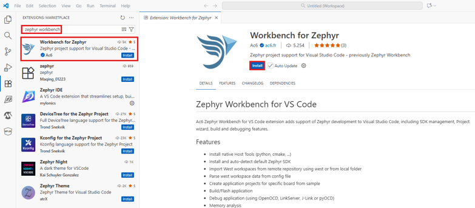

**Step 2** - Click on "Trust Publishers & Install" for installing the extension as shown below.


**Step 3** - Once the installation is complete, the Zephyr Workbench icon will appear in the left-side activity bar of VS Code.

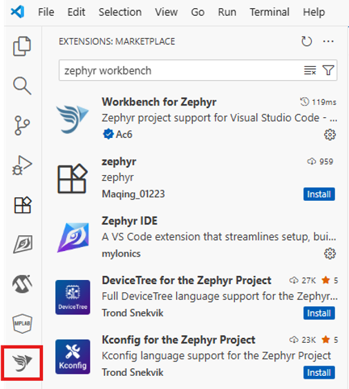

## 4. Zephyr Environment Setup<a name="step4">

### Three-Step Environment Setup

  1. Host Tool Updates
  2. Initialize the West Workspace
  3. Install the Toolchain

### 1.Host Tool Updates

**Step 1** - Go to Zephyr Workbench and click on "Install Host Tools".

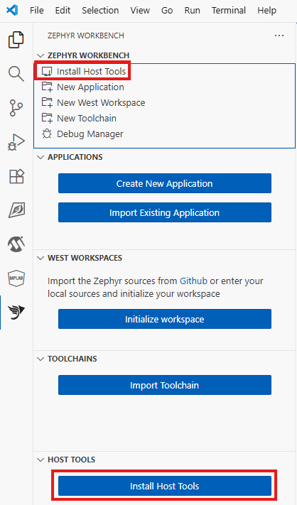

**Step 2** - After Installation is complete, you can check the installed packages in the TERMINAL as shown below.

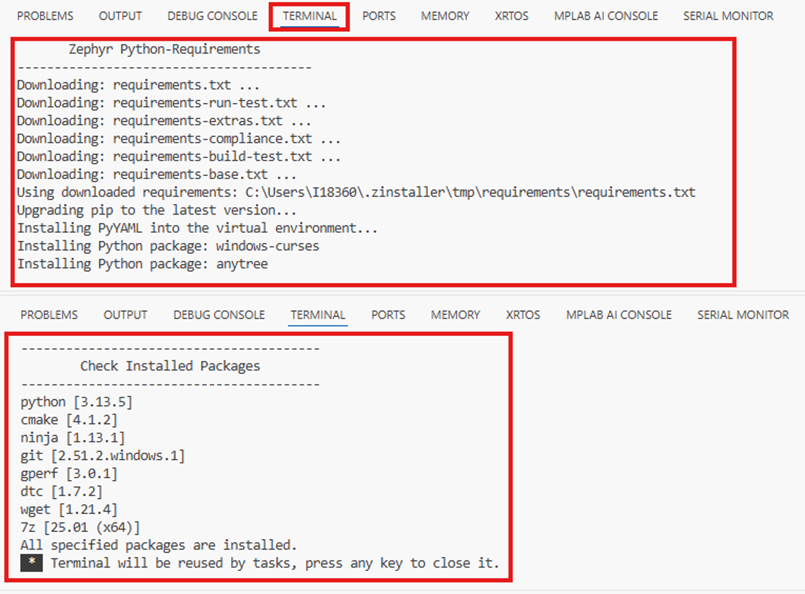

**Step 3** - Verify the Installation Status. If any packages are missing Reinstall host tools.

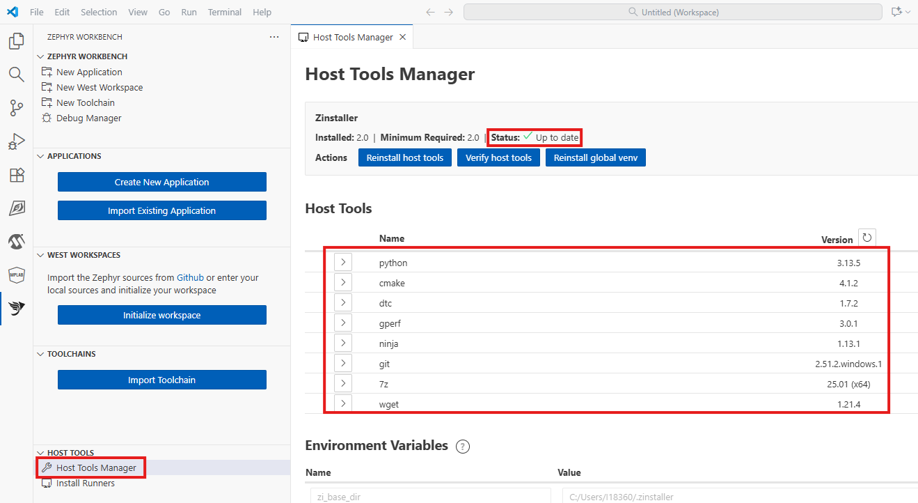


### 2.Initialize the West Workspace

**Step 1** - Go to WEST WORKSPACES Tab and click on "Initialize workspace".

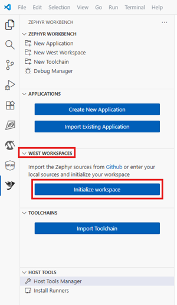

**Step 2** - Refer the below images for configuring in the Create west workspace window.

- Select "Repository" for source location and copy paste the path as shown below.

  ```
  https://github.com/Zephyr4Microchip/zephyr.git

  ```
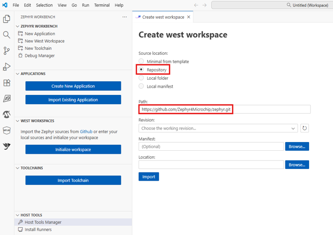

- Refresh and choose the revision as
  ```
  mchp_pic32cxbz_v420
  ```

- Create a directory as shown below and add the location as the same.
  ```
  c:\developers\zephyrproject_wsg
  ```

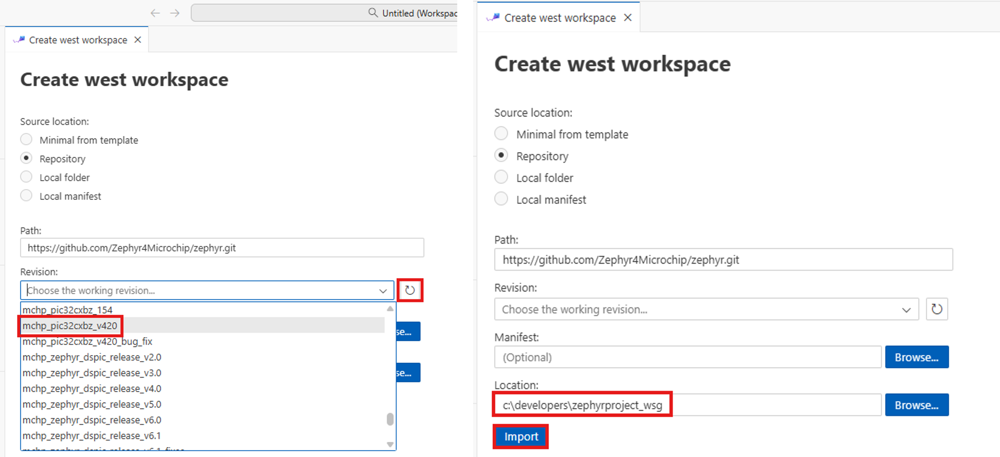

- Then click on Import.

- Once the installation completes the terminal prints the below status.

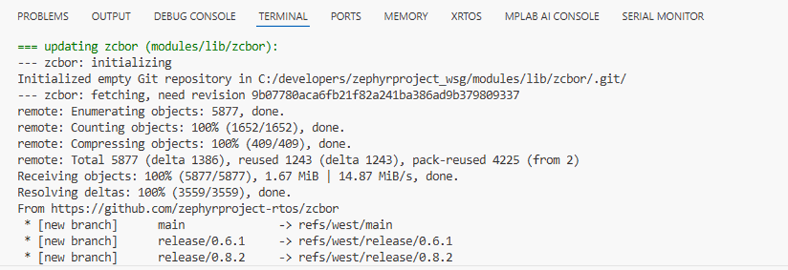

### 3.Install the Toolchain

**Step 1** - Go to TOOLCHAINS Tab and click on "Import Toolchain".

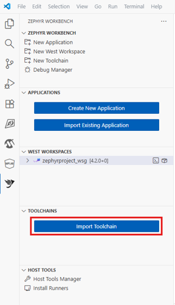

**Step 2** - In Add Toolchain Tab Choose the below configurations.

- Toolchain family : Zephyr SDK
- Source : Official
- SDK Type : Minimal
- Version : v0.17.4
  - arm (select the checkbox)
- Location :
  ~~~
  c:\developers\zephyrproject_wsg
  ~~~

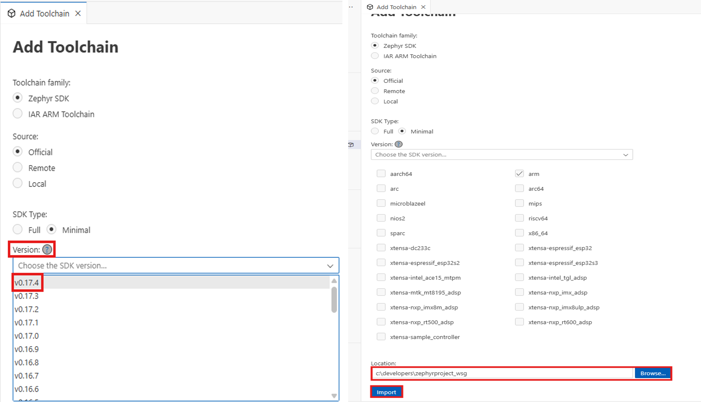

- Then click on Import.

## 5. Importing Existing Application<a name="step5">

**Step 1** - Go to APPLICATIONS Tab and click on "Import Existing Application"

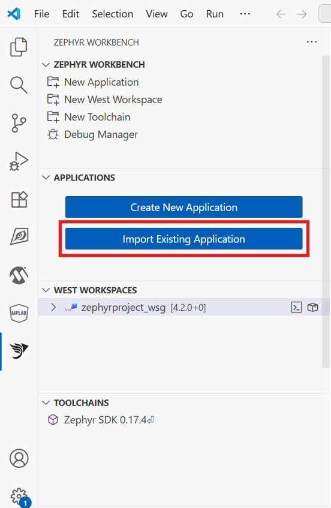

**Step 2** - Click on Folder icon & Choose the Sample Project as Shown below.

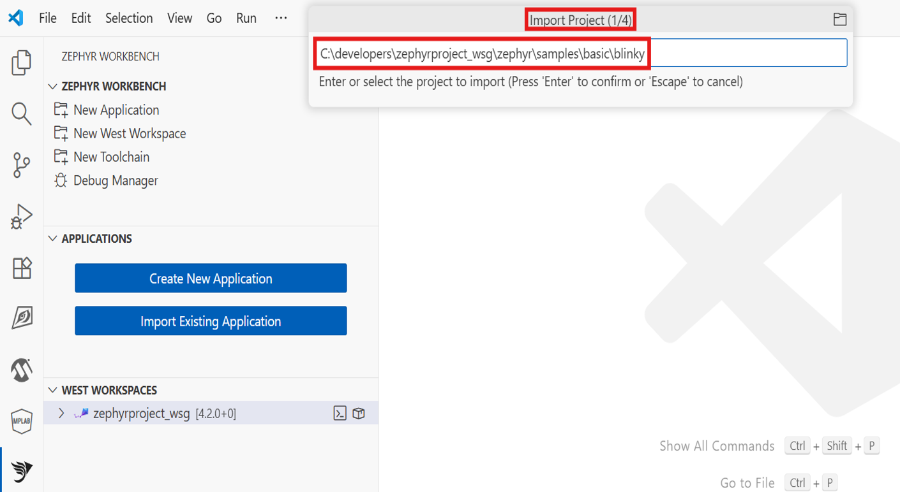

**Step 3** - Select the west workspace

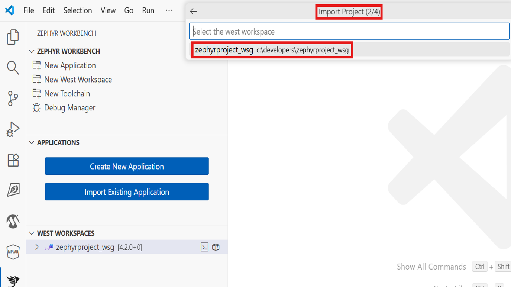

**Step 4** - Select the toolchain (SDK Latest version : 0.17.4)

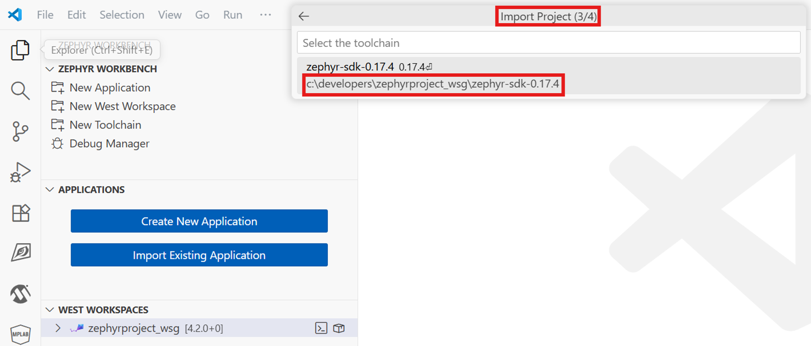

**Step 5** - Select the target board

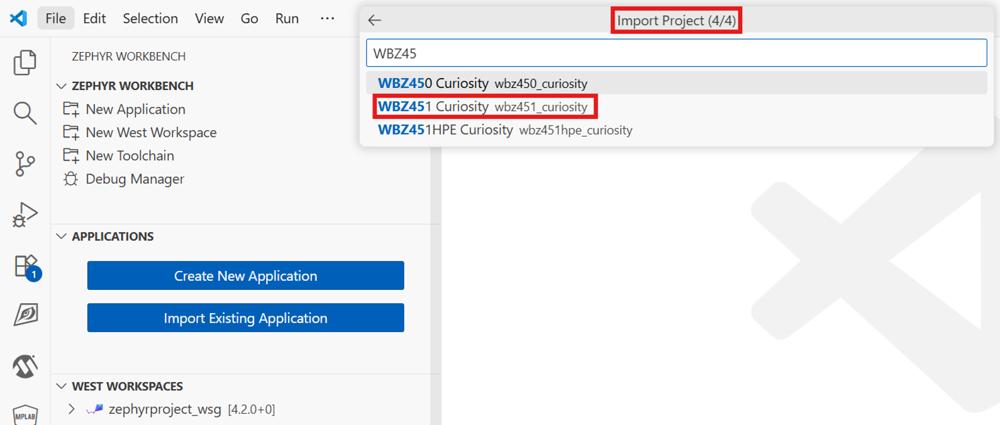

**Step 5** - The Project will be added to the APPLICATIONS tab as shown below.

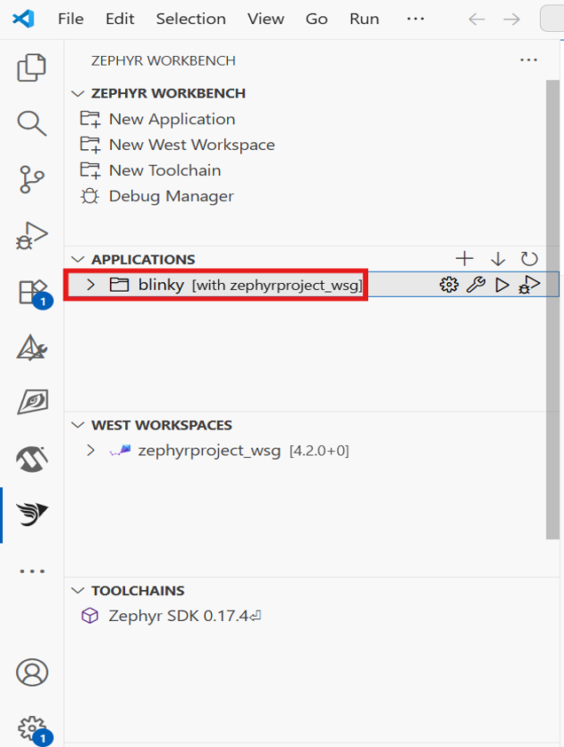


## 6. Building the Application<a name="step6">

- Click on Build icon as shown in the below image and then your application will be build successfully.

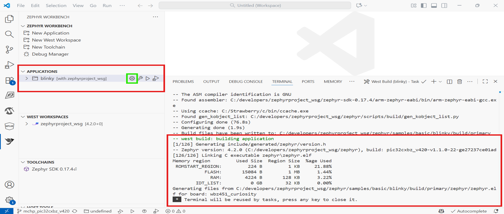

- Before building any Wireless Applications, download the required libraries using below steps.

  - **Step 1** - Right click the workspace (zephyrproject_wsg) in WEST WORKSPACES as shown below.

    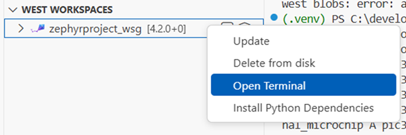

  - **Step 2** - A new Terminal window would open. Enter the below command as shown.
     ~~~
     west blobs fetch hal_microchip
     ~~~

    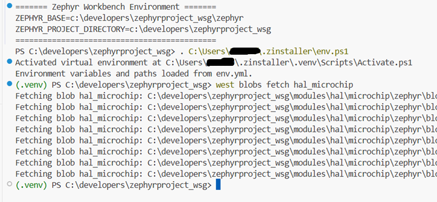


## 7. Installing OpenOCD for Programming<a name="step7">

| ⚠ Warning : Connect your target board to your PC before running the script|
| :-|

- Copy & paste the python script "installOpenOCD_WSG_BZx.py" in the [Workbench_images](Workbench_images/installOpenOCD_WSG_BZx.py) folder to the below mentioned folder.

  ```
  c:\developers\zephyrproject_wsg

  ```
- Run the Python script as shown below.

- After running the script
  - Choose 1 for changing the Default MPLAB PKOB4 to OpenOCD CMSIS-DAP.
  - Choose 2 for changing the OpenOCD CMSIS-DAP to Default MPLAB PKOB4.

  | ⚠ Warning : **Important Note: Select 2 and switch the firmware back to PKOB4 before using with MPLABX IDE/IPE. This selection decides whether the board works for OpenOCD or MPLABx.|
  | :-|


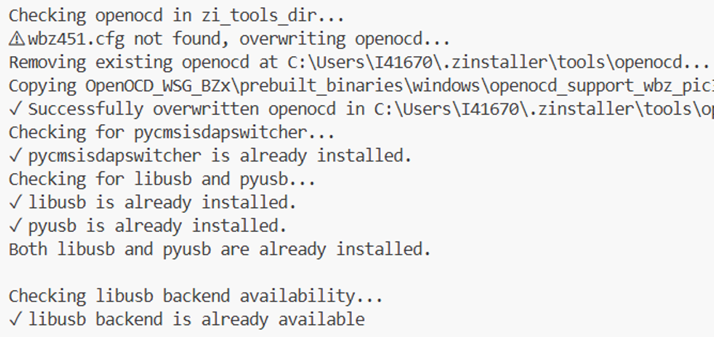

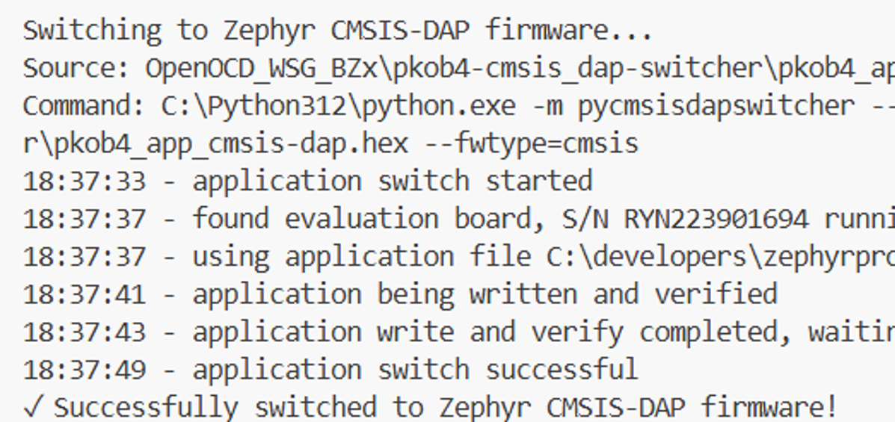

- Finally the python script will successfully switch to OpenOCD CMSIS-DAP firmware.

## 8. Flashing the Application<a name="step8">

| ⚠ Warning : For PIC32CXBZ6 copy and paste (overwrite) the python script "gen_signed_hex.py" in the [Workbench_images](Workbench_images/gen_signed_hex.py) folder to  "C:\developers\zephyrproject_wsg\zephyr\soc\microchip\pic32c\pic32cx_bz\bz6x\gen_signed_hex.py" folder.|
| :-|

- Click on Run icon as shown in the below image and then choose the "--runner openocd" for flashing the project.

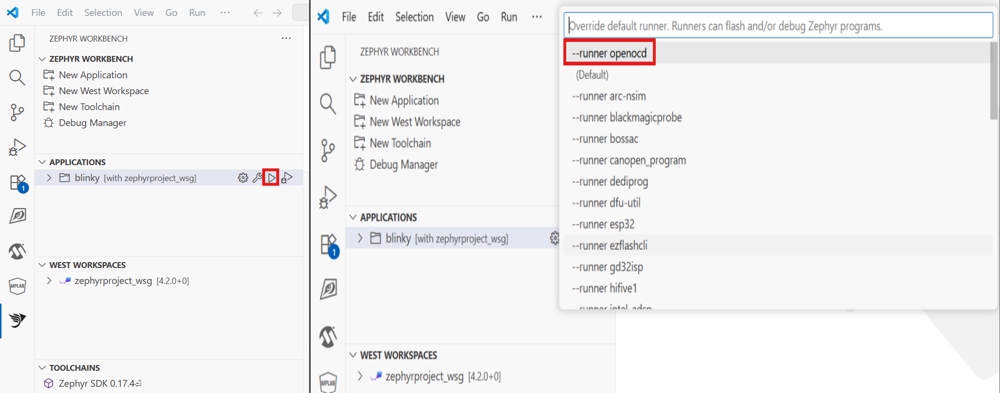

- After Successful Flashing your terminal log look as below.

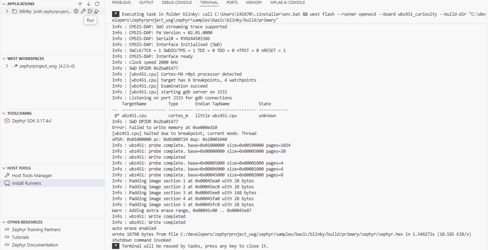

- Now you can see the application running in the target board.

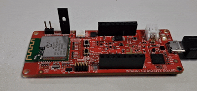
