# WORKBENCH FOR ZEPHYR

## Contents

1. [Introduction](#step1)
2. [Software Setup](#step2)
3. [Getting Started with Workbench for Zephyr](#step3)
4. [Zephyr Environment Setup](#step4)
5. [Install Device Libraries](#step5)
6. [Install OpenOCD for Programming](#step6)
7. [Import Existing Application](#step7)
8. [Build the Application](#step8)
9. [Flash the Application](#step9)


## 1. Introduction<a name="step1">

### Workbench for Zephyr

The Workbench for Zephyr is an integrated development environment (IDE) and set of tools that streamline the process of creating, building, and debugging Zephyr-based applications. It simplifies environment setup, project management, and workflow, allowing developers to focus on application logic and hardware integration.

This guide will walk you through the essential steps to get started with Zephyr, including environment setup, importing sample applications, building, and flashing firmware to your target device.

## 2. Software Setup<a name="step2">

- [Visual Studio Code](https://code.visualstudio.com/)
- [Workbench for Zephyr](https://marketplace.visualstudio.com/items?itemName=Ac6.zephyr-workbench) - Extension in Visual Studio
- [Python](https://www.python.org/downloads/latest/python3.14/)

## 3. Getting Started with Workbench for Zephyr<a name="step3">

### Install Extension: Workbench for Zephyr

**Step 1** - After installing [Visual Studio Code](https://code.visualstudio.com/) search for "Workbench for Zephyr" in extension, click on dropdown of install and select "Install Pre-Release Version" as shown below.

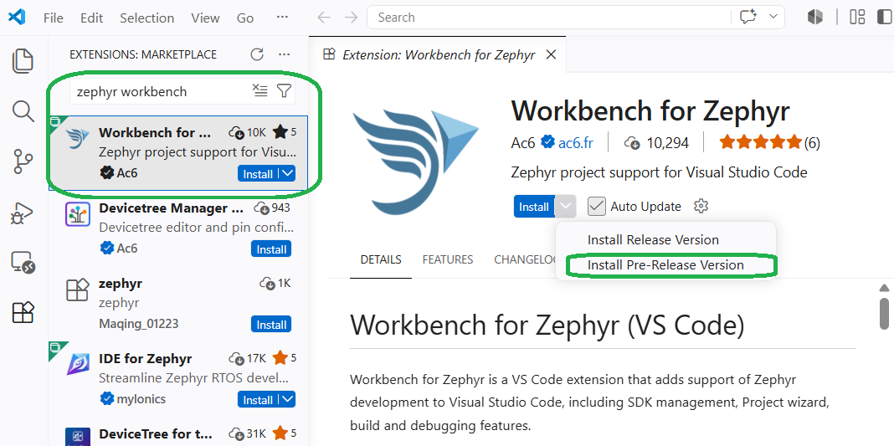

**Step 2** - Click on "Trust Publishers & Install" for installing the extension as shown below.

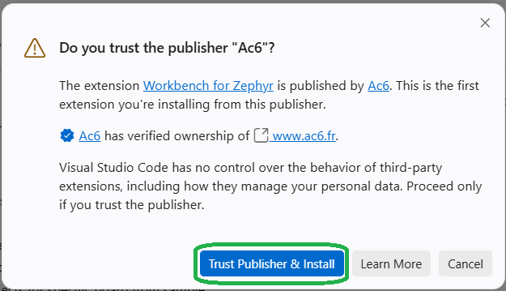

**Step 3** - Once the installation is complete, the Zephyr Workbench icon will appear in the left-side activity bar of VS Code.

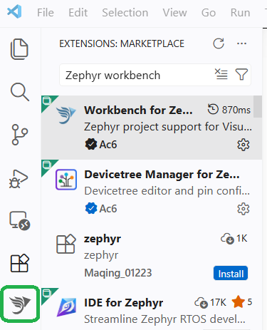

## 4. Zephyr Environment Setup<a name="step4">

### Three-Step Environment Setup

  1. Host Tool Updates
  2. Initialize the West Workspace
  3. Install the Toolchain

### 1.Host Tool Updates

**Step 1** - Go to Zephyr Workbench and click on "Install Host Tools".

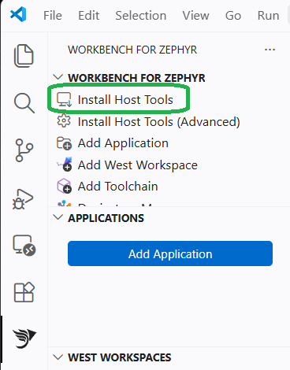

**Step 2** - After Installation is complete, you can check the installed packages in the TERMINAL as shown below.

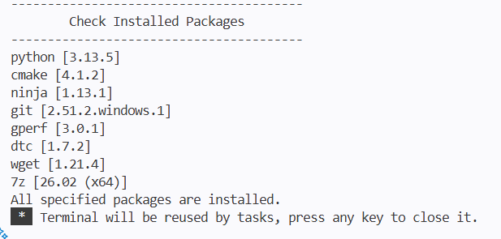

**Step 3** - Verify the Installation Status. If any packages are missing Reinstall host tools.

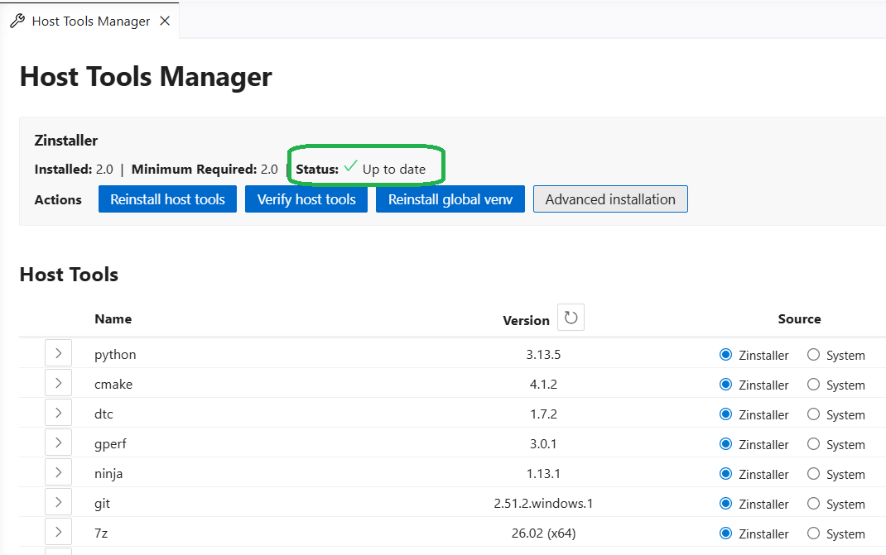


### 2.Initialize the West Workspace

**Step 1** - Go to WEST WORKSPACES Tab and click on "Initialize workspace".

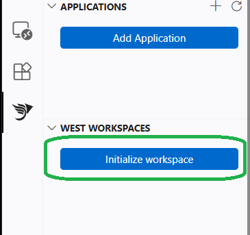

**Step 2** - Refer the below images for configuring in the Create west workspace window.

- Select "Repository" for source location and copy paste the below path.

  ```
  https://github.com/Zephyr4Microchip/zephyr.git

  ```

- Refresh and choose the revision as
  ```
  mchp_pic32cxbz_v420
  ```

- Create a directory as shown below and add the location as the same.
  ```
  c:\developers\zephyrproject_wsg
  ```

- Expand the "Advanced options" and uncheck "Fetch west blobs".

- Remove the "zephyrproject" in Subfolder and verify the below screen capture before hitting Import.

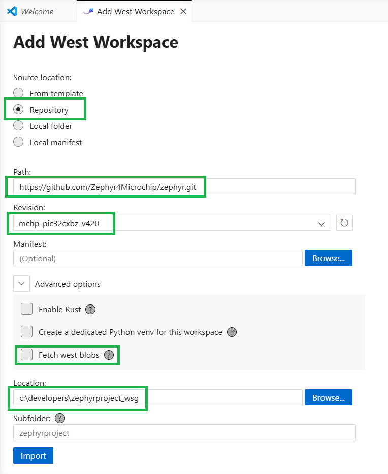

- Then click on Import.

- Once the installation completes, workspace will be available in "WEST WORKSPACES" as below.

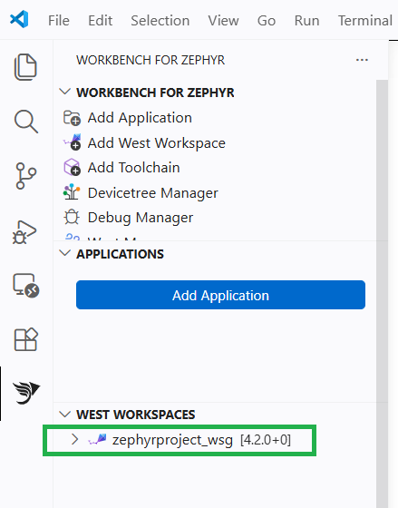

### 3.Install the Toolchain

**Step 1** - Go to TOOLCHAINS Tab and click on "Import Toolchain".

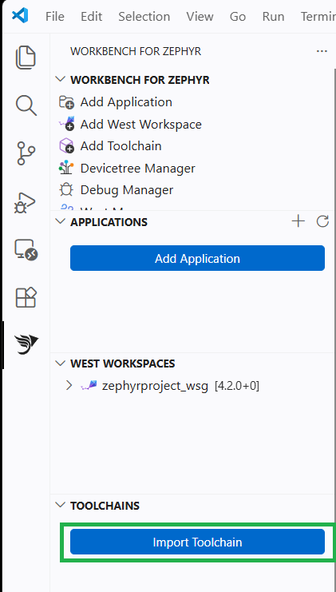

**Step 2** - In Add Toolchain Tab Choose the below configurations.

- Toolchain family : Zephyr SDK
- Source : Official
- SDK Type : Minimal
- Version : v0.17.4
  - arm (select the checkbox)
- Location :
  ~~~
  c:\developers\zephyrproject_wsg
  ~~~

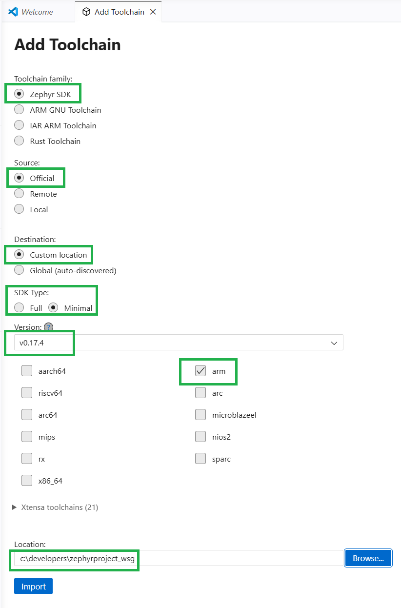

- Then click on Import.

**Step 2** - Verify that the Toolchain is installed properly if its listed in TOOLCHAINS as shown below.

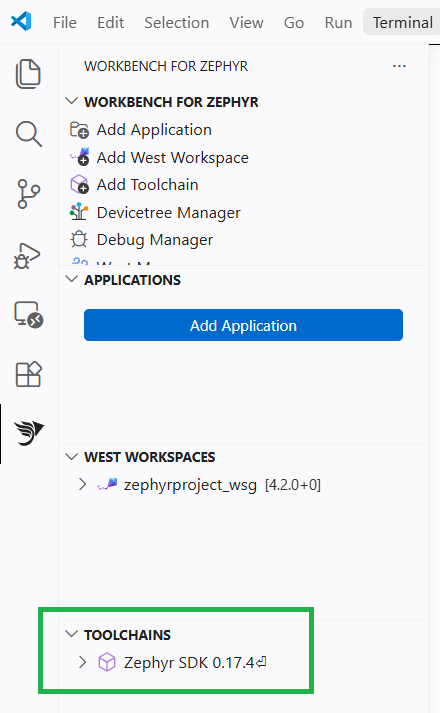

## 5. Install Device Libraries<a name="step5">

**Step 1** - Right click the workspace (zephyrproject_wsg) in WEST WORKSPACES as shown below.

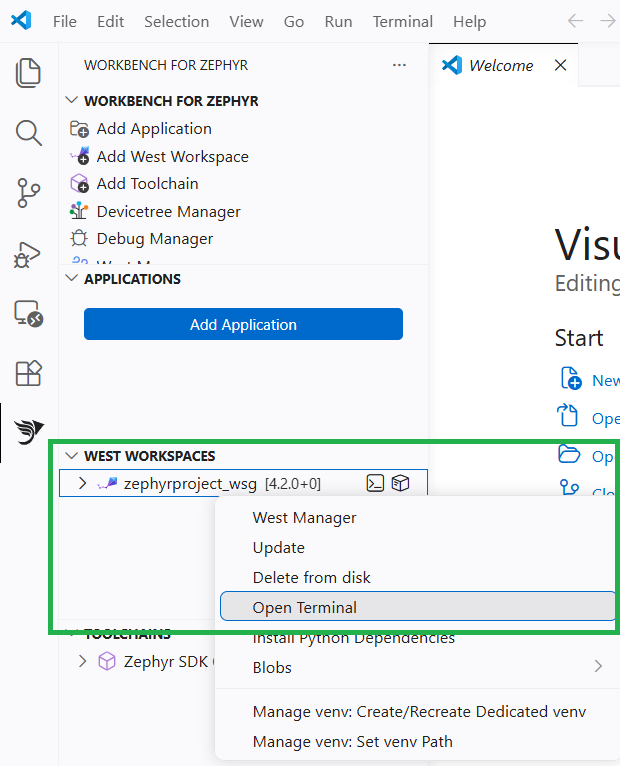

**Step 2** - A new Terminal window would open and enter the below command to download the Device Libraries.
     ~~~
     west blobs fetch hal_microchip
     ~~~

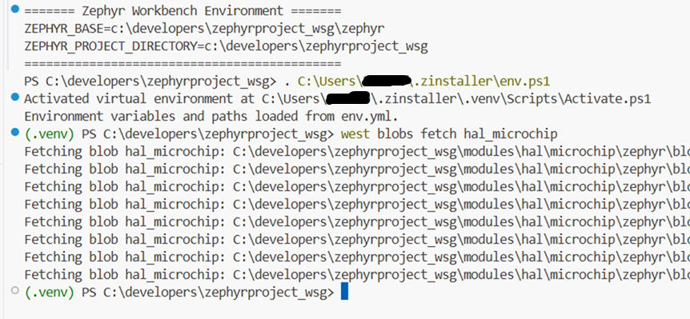

## 6. Installing OpenOCD for Programming<a name="step6">

### Install Custom OpenOCD support

| ✅ Note : As support for these devices has not yet been merged into the OpenOCD mainline, the following step is currently required|
| :-|

- Download the python scripts "installOpenOCD_WSG_BZx.py" and "switchFirmware.py" from the [Workbench_images](Workbench_images/) folder to the below mentioned folder.

  ```
  c:\developers\zephyrproject_wsg

  ```
- Click Terminal and select "New Terminal" as shown below.

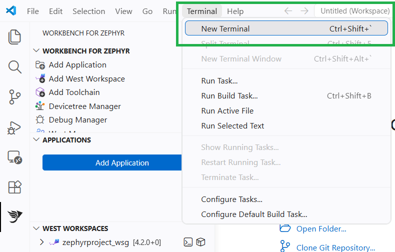

- Run the install script to set up OpenOCD and its dependencies as shown below.

  ```
  python installOpenOCD_WSG_BZx.py
  ```

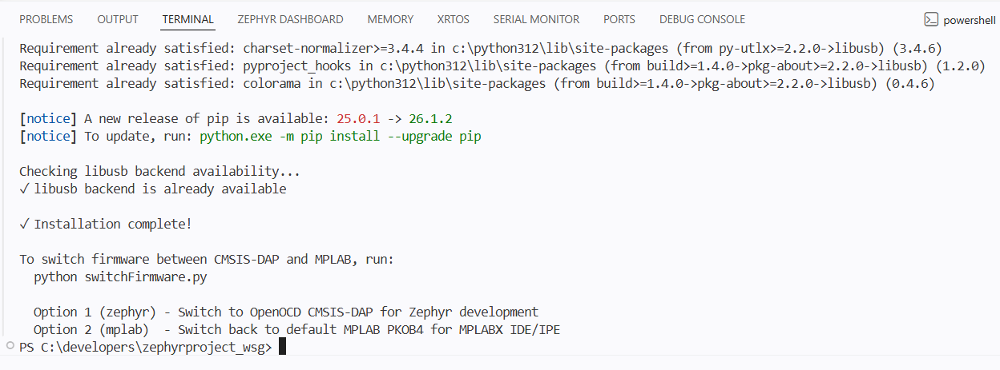

### Switching Programmer between Zephyr and MPLABx

| ⚠ **Warning** |
| :- |
| - Connect your target board to your PC before running the below script.<br>- Zephyr uses **CMSIS mode**, while **MPLAB X IPE** uses **PKOB mode** of the programmer/debugger.<br>- Default configuration of fresh board is PKOB mode to support MPLABx |

To switch programmer at any time after the initial setup, run the standalone switcher script.

	```
	python switchFirmware.py
	```

- Choose **1** (or **zephyr**) to switch to OpenOCD CMSIS-DAP programmer (for Zephyr development).
- Choose **2** (or **mplab**) to switch back to the default MPLAB PKOB4 programmer.

| ⚠ Warning : Always switch back to MPLAB PKOB4 (option 2) before using the board with MPLABX IDE/IPE.|
| :-|

- Type **1** (or **zephyr**) to switch to CMSIS-DAP mode as shown below.

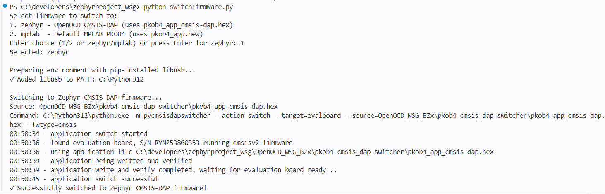

## 7. Import Existing Application<a name="step7">

**Step 1** - Go to APPLICATIONS Tab and click on "Add Application" as shown below.

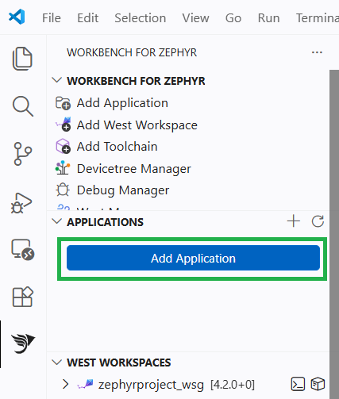

**Step 2** - Select the West Workspace, Toolchain, Board, Import exisiting application, Project Location as shown below and click on Create.

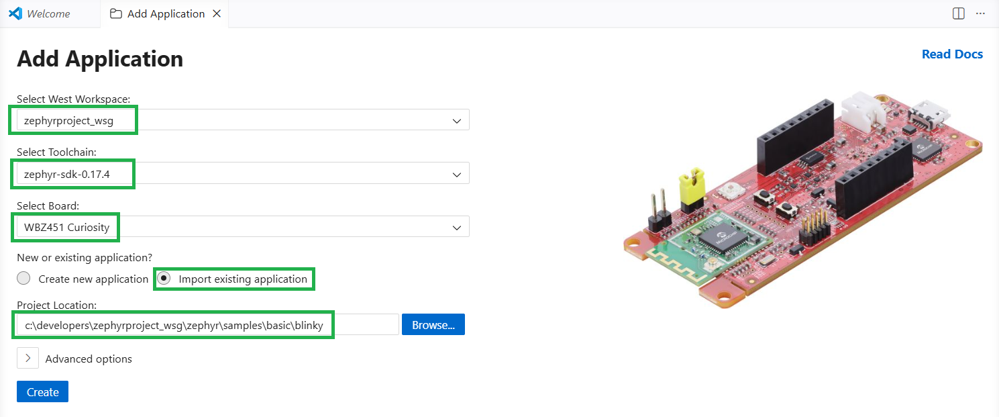

## 8. Build the Application<a name="step8">

- Click on Build icon as shown in the below image and then your application will be built successfully.

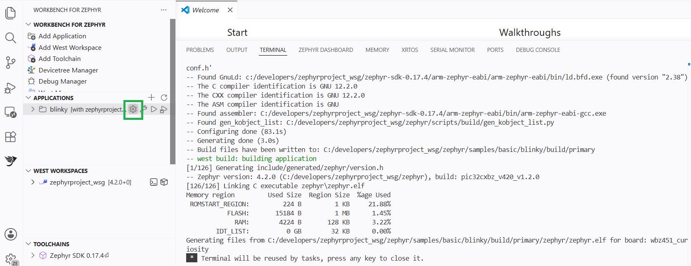

## 9. Flash the Application<a name="step9">

- Click on Flash icon as shown in the below image and then choose the "openocd" for flashing the project.

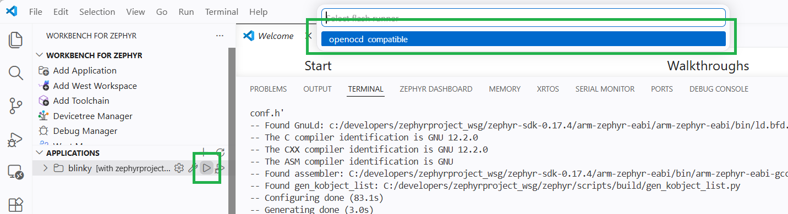

- After Successful Flashing your terminal log look as below.

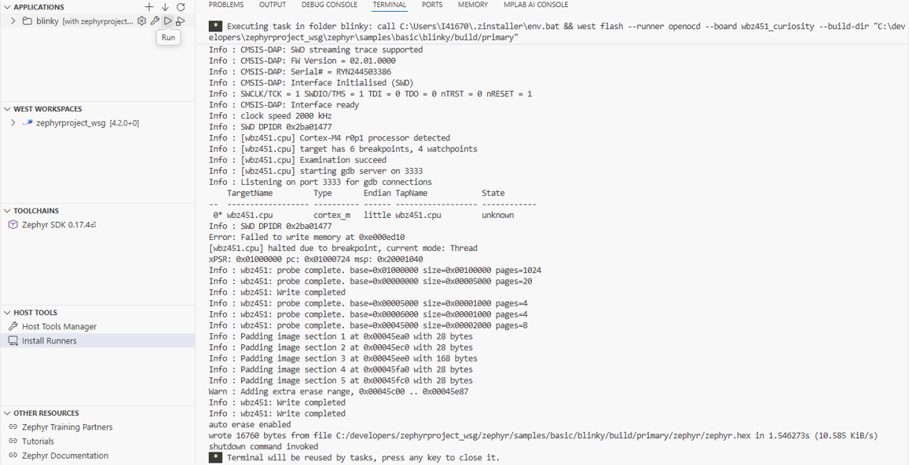

- Now you can see the application running in the target board.

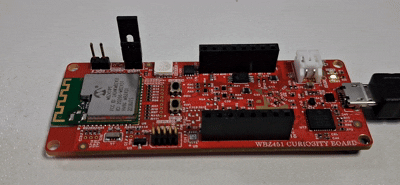
